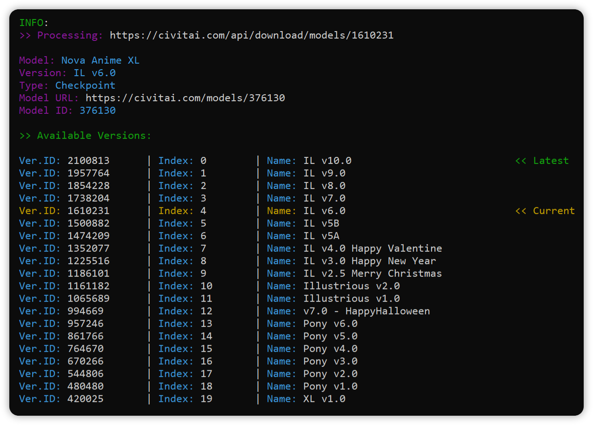

<div align="center">
  <h1>CivitAI Model Information Fetcher</h1>
  
</div>

> [!Warning] > **This script was primarily written for personal use with the help of AI.**</br>
> _Since I don't really care about its elegance (as long as it works :33), the code is written accordingly!_</br>
> Please note: THIS script does not work directly with models, but rather with DATA recorded in files.

## Features

-   🔍 **Multi-format Input Support**: Process URLs from command line, files (JSON, Python, TXT), or mixed sources
-   🚀 **Batch Processing**: Handle multiple URLs concurrently with connection pooling
-   📊 **Rich Data Export**: Export model information to structured JSON format
-   🎨 **Colored Console Output**: Beautiful, organized display with syntax highlighting
-   🔄 **Retry Logic**: Robust error handling with automatic retries for failed requests

## Installation

1. Clone the repository:

```bash
git clone https://github.com/anxety-solo/civitai-model-fether
cd civitai-model-fetcher
```

2. Install required dependencies:

```bash
pip install aiohttp colorama
```

3. Get your CivitAI API key from [CivitAI Settings](https://civitai.com/user/account)

## Usage

### Basic Commands

```bash
# Process single URL
python CivitAI_fetcher.py https://civitai.com/models/12345

# Process by model ID (slower, as it needs to verify that the ID is valid)
python CivitAI_fetcher.py 12345

# Process multiple URLs
python CivitAI_fetcher.py url1 url2 url3

# Process URLs from file
python CivitAI_fetcher.py -f models.json

# Show model URLs in output
python CivitAI_fetcher.py -f models.txt -u

# Show download URLs
python CivitAI_fetcher.py -f models.py -d

# Export data to JSON
python CivitAI_fetcher.py -f models.json --export my_models.json

# Enable verbose logging (primarily for debugging)
python CivitAI_fetcher.py -f models.txt -v
```

### Advanced Usage

```bash
# Combine multiple input sources
python CivitAI_fetcher.py url1 url2 -i url3 url4 -f models.json

# Manage API keys
python CivitAI_fetcher.py -k

# Show file format examples
python CivitAI_fetcher.py --show-help
```

## Command Line Options

| Option                | Description                                        |
| --------------------- | -------------------------------------------------- |
| `urls`                | Input URLs (can be used without -i flag)           |
| `-i, --input`         | Additional input URLs (space/comma separated)      |
| `-f, --file`          | Path to model list file (JSON/Python/TXT)          |
| `-u, --show-url`      | Display model URLs                                 |
| `-d, --show-download` | Display download URLs                              |
| `-k, --change-key`    | Manage API keys (add/remove)                       |
| `--show-help`         | Show file format examples                          |
| `--export`            | Export data to JSON (default: civitai_export.json) |
| `-v, --verbose`       | Enable verbose logging                             |

## Input File Formats

### JSON Format

```json
{
    "My Models 1": [
        { "url": "https://civitai.com/models/1234", "name": "model1.safetensors" },
        { "url": "https://civitai.com/models/5678", "name": "model2.safetensors" }
    ],
    "My Models 2": [{ "url": "https://civitai.com/models/9012", "name": "model3.safetensors" }]
}
```

### Python Format

```python
model_list = {
    "Category 1": [
        {"url": "https://civitai.com/models/1234", "name": "modelA.safetensors"}
    ]
}

another_collection = {
    "Category 2": [
        {"url": "https://civitai.com/models/5678", "name": "modelB.safetensors"}
    ]
}
```

### Text Format

```text
https://civitai.com/models/1234
https://civitai.com/models/5678 model1.safetensors
https://civitai.com/models/9012, https://civitai.com/models/3456
```

## Output Data Structure

The exported JSON contains structured model information:

```json
{
    "model_id": "12345",
    "model_name": "Example Model",
    "model_type": "Checkpoint",
    "url": "https://civitai.com/models/12345",
    "versions": [
        {
            "version_id": "67890",
            "version_name": "v1.0",
            "created_at": "2024-01-01T00:00:00.000Z",
            "updated_at": "2024-01-01T00:00:00.000Z",
            "download_url": "https://civitai.com/api/download/models/67890",
            "early_access": false,
            "size": "2.1 GB",
            "base_model": "SD 1.5",
            "trained_words": ["anime"],
            "url": "https://civitai.com/models/12345?modelVersionId=67890"
        }
    ]
}
```

## Configuration

The tool automatically creates a `data/` directory to store:

-   `civitai_config.json` - API key configuration
-   `exports/` - Exported JSON files
